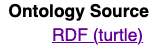

.. image:: https://rawcdn.githack.com/RDFLib/pyLODE/b1ff1b1e19262cdc21ee28c7362b1690ca18e30b/img/pyLODE-250.png

.. image:: https://badge.fury.io/py/pyLODE.svg
    :target: https://badge.fury.io/py/pyLODE

pyLODE
******
An OWL ontology documentation tool using Python and templating, based on
LODE.

In addition to making human-readable forms of ontologies/taxonomies, pyLODE encourages ontology annotation *best
practice* by only producing good results for well documented inputs! pyLODe defines what it considers w'well documented'
in sections below, such as `Profiles`_ & `What pyLODE understands`_.

Contents
========
1. `Quick Intro`_
2. Examples_
3. Installation_
4. Use_
5. `What pyLODE understands`_
6. `Profiles`_
7. `Differences from LODE`_
8. `Releases`_
9. License_
10. Citation_
11. Collaboration_
12. Contacts_

Quick Intro
===========
The Live OWL Documentation Environment tool
(`LODE <https://github.com/essepuntato/LODE>`__) is a well-known (in
Semantic Web circles) Java & XSLT-based tool used to generate
human-readable HTML documents for OWL and RDF ontologies. That tool is
now a bit dated (old-style HTML, use of older technologies like XSLT)
and it's (`online version <https://www.essepuntato.it/lode>`__) is not always
online.

This tool is a complete re-implementation of LODE's functionality using
Python and Python's RDF manipulation module,
`rdflib <https://pypi.org/project/rdflib/>`__. An ontology to be
documented is parsed and inspected using rdflib and HTML or Markdown is generated
using basic Python scripting and Python's `Jinja2
templating <https://pypi.org/project/Jinja2/>`__.

The tool can be run as in these ways:

- Python command line
    - cli.py in the main folder
- BASH command line
    - bin/ directory, uses cli.py
- as-a-service locally
    - via the popular `Falcon framework <https://falconframework.org/>`__.
    - see server.py in the main folder
- as-a-service online
    - hosted at https://pylode.surroundaustralia.com

Examples
========
pyLODE has been tested with all of the 30+ ontologies in `pylode/examples/ <pylode/examples/>`_ and we are trying to
ensure it captures all of their annotations. For each example, there is the original RDF file and the corresponding
output, in HTML & Markdown. There are some examples of ADOC too.

For example, `Epimorphic's <https://www.epimorphics.com/>`__'s **Registry Ontology** is:

- **reg.ttl** - source file
- **reg.html** - HTML output
    - this is a couple of releases ahead of the `online version <https://epimorphics.com/public/vocabulary/Registry.html>`_
- **reg.md** - Markdown output

Another, the Australian Government's Records Interoperability Framework (AGRIF) Ontology:

- **agrif.ttl** - source file
- **agrif.html** - HTML output
    - see this `rendered online by GitHack <https://raw.githack.com/RDFLib/pyLODE/master/pylode/examples/agrif.html>`__
    - see `the point-of-truth rendered online <https://linked.data.gov.au/def/agrif>`__
- **agrif.md** - Markdown output
    - see this `rendered online by GitHub <https://github.com/RDFLib/pyLODE/blob/master/pylode/examples/agrif.md>`__
- **agrif.md** - ASCIIDOC output
    - `resulting ADOC source <https://github.com/RDFLib/pyLODE/blob/master/pylode/examples/agrif.adoc>`__
    - `rendered in HTML <https://github.com/RDFLib/pyLODE/blob/master/pylode/examples/agrif.adoc.html>`__
- **agrif.skos.html** - HTMl output, "vocpub" profile
    - see this `rendered online by GitHack <https://raw.githack.com/RDFLib/pyLODE/master/pylode/examples/agrif.vocpub.html>`__

You can build all of the example outputs locally by running `pylode/examples/_make_examples.py <pylode/examples/_make_examples.py>`_
which also serves as a good demonstration of calling pyLODE from a Python file.

Ontologies online using pyLODE:
-------------------------------

- `Australia's Department of Finance's <https://www.finance.gov.au>`__'s **AGRIF ontology** - http://linked.data.gov.au/def/agrif
    - see the `Markdown version <https://github.com/AGLDWG/agrif-ont/blob/master/agrif.md>`__
- `National Archives of Australia <http://www.naa.gov.au>`__'s **Commonwealth Records Series ontology** - http://linked.data.gov.au/def/crs
    - see the `Markdown version <https://github.com/RDFLib/pyLODE/blob/master/pylode/examples/crs.md>`__
- `CSIRO's <https://www.csiro.au>`__'s **LocI ontology** - http://linked.data.gov.au/def/loci
-  `Geological Survey of
   Queensland <https://www.business.qld.gov.au/industries/mining-energy-water/resources/geoscience-information/gsq>`__'s
   **Boreholes Profile** - http://linked.data.gov.au/def/borehole
-  `Geoscience Australia <http://www.ga.gov.au/>`__'s **Place Names
   Profile** - http://linked.data.gov.au/def/placenames
-  `Epimorphic <https://www.epimorphics.com/>`__'s **Registry Ontology**
   - https://epimorphics.com/public/vocabulary/Registry.html
- `Semantic Web for Earth and Environmental Terminology <http://sweetontology.net>`__ (SWEET)
   - a series of ontologies that are live rendered into HTML via pyLODE being called by a Falcon server

See pairs of RDF & HTML files in the
`pylode/examples/ <pylode/examples/>`__ directory for other,
preprocessed examples.

Installation
============
This tool can be used either as a command line utility (Linux, Mac or Windows, see below) or as a Python module in other Python code. It can also be used via a hosted, online, service or even as a local web server that you can run. This repo contains executable files for Mac & Windows (soon Linux!) that you can use without any installation too.

The most important dependency to get correct when using this as a Python script of a command line program is the package ``rdflib`` which must be v5.0.0 or greater (see requirements.txt).

Python
------
Do this to use pyLODE as a Python command line program.

This tool is available on PyPI, the Python Package Index, at https://pypi.org/project/pyLODE/ and can be installed for use as a Python module via pip:

::

    pip install pylode

To use pyLODE within Python, try something like this:

::

    import pylode

    html = pylode.MakeDocco(
        input_data_file=input_file_path,
        outputformat="html",
        profile="ontdoc"
    ).document()

You will now have the HTML content within the variable ``html``.

For desktop command line use, just clone this repository and either use ``cli.py`` as per the command line instructions below or use makedocco.py as a Python script directly.

Use
===
pyLODE presents natively as a Python command-line utility,
`pylode/cli.py <pylode/cli.py>`__ and there are also a BASH, Windows & Mac OS options available for command line use:

* `pylode/bin/pylode.sh <pylode/bin/pylode.sh>`__ - BASH script
* Linux executable coming soon!
* `pylode/bin/pylode.app <pylode/bin/pylode.app>`__ - MAC OS command line executable script
* `pylode/bin/pylode.exe <pylode/bin/pylode.exe>`__ - Windows command line executable

All use the same command line arguments.

Additionally, there is a `Falcon framework <https://falconframework.org/>`__ local HTTP server option.

Also, a web UI for pyLODE is available at `<https://pylode.surroundaustralia.com>`.

Command line arguments
----------------------
These are the command line arguments to run pyLODE as a BASH or Python script on Linux, Mac etc. or via the Windows executable:

-  ``-i`` or ``--inputfile``, *required if* ``-u`` *not used*
    -  The RDF ontology file you wish to generate HTML for Must be in either Turtle, RDF/XML, JSON-LD or N-Triples formats indicated by the file type extensions .rdf, .owl, .ttl, .n3, .nt, .json respectively
-  ``-u`` or ``--url``, *required if* ``-i`` *not used*
    -  The RDF ontology you wish to generate HTML for, online. Must be an absolute URL that can be resolved to RDF, preferably via Content Negotiation.
-  ``-c`` or ``--css``, *optional, default 'true'*
    -  Whether (true) or not (false) to include CSS in an HTML output.
-  ``-o`` or ``--outputfile``, *optional*
    -  A name you wish to assign to the output file. Will be postfixed with .html, .md or .adoc. If not specified, the name of the input file or last segment of RDF URI will be used, + .html/.md/.adoc.
-  ``-f`` or ``--outputformat``, *optional, default 'html'*
    - The output format of the documentation. 'html', 'md' or 'adoc' accepted.
-  ``-p`` or ``--profile``, *optional, default 'ontdoc'*
    - The profile (specification) for ontology documentation used. "ontdoc" (for OWL Ontologies), "vocpub" (for `Simple Knowledge Organization System (SKOS) <https://www.w3.org/TR/skos-reference/>`__) vocabularies or SKOS versions of OWL ontologies, "prof" for `Profiles Vocabularies <https://www.w3.org/TR/dx-prof/>`__ profiles. See ``-lp`` for all profiles supported.
-  ``-lp`` or ``--listprofiles``, *optional, no arguments*
    - Lists all the profiles (specifications) for ontology documentation supported by pyLODE

Example call
------------
This basic call to the BASH script in `pylode/bin/ <pylode/bin/>`__ will
print to standard out an HTML document for an ontology called ``placenames.html``.

::

    ./pylode -i ../example/prof.ttl

An output file could be specified by using `-o`, rather than printing to standard out.

Online Service
--------------
An online version of pyLODE is now available at https://pylode.surroundaustralia.com/.

Docker
------
Install locally by first building the container

::

    docker build -t pylode:latest --build-arg PYTHON_VERSION=3.8-slim .

Then run the container

::

    docker run -it -d -p 8000:8000 -e GTAGID=${Google TagID} pylode

N.B. The Google TagID is NOT required unless Google Analytics is required.
It looks as follows `GTAGID=UA-168806395-1`.

You can now access the service on localhost

::

    curl localhost:8000/lode?url=http://sweetontology.net/sweetAll.ttl

Local server - Falcon
---------------------
You can run pyLODE using your own, local, HTTP server like this:

::

    gunicorn --chdir /path/to/pyLODE/pylode server:api

The server is then available at localhost:8000 and localhost:8000/pylode for the active endpoint. Note that the server must be fed a URL to an ontology to document supplied by a server capable of responding to Content Negotiation, i.e. it must supply RDF according to an HTTP `Accept` request for `text/turtle`, `application/rdf+xml` etc.

::

    curl localhost:8000/pylode?url=http://sweetontology.net/sweetAll.ttl

Windows
-------
In ``pylode/bin/``, a Windows executable, ``pylode.exe`` is available for command line use.

Be sure to add ``pylode.exe`` to your Windows user's PATH variable so you can run ``pylode.exe`` from any folder. Just run the Registry Editor (search for "Regedit" in the Start menu) and then navicate to HKEY_CURRENT_USER > Environment > Path. Adding the full path of the folder ``pylode/bin/`` to Path will ensure you can run ``pylode.exe`` within the Windows command prompt, regardless of what folder you are in.

You can rebuild the ``pylode.exe`` file from the source code, if you like. Use the Python program `Pyinstaller <https://www.pyinstaller.org/>`__ as per
`its instructions <https://pyinstaller.readthedocs.io/en/stable/usage.html>`__. The created ``pylode.exe`` will have the same characteristics as the Linux/Mac
CLI program.

Pyinstaller uses a ``.spec`` file to make the binary and that is included in this repository: ``pylode-cli.spec``.

See `the PyInstaller installation guide <https://pyinstaller.readthedocs.io/en/stable/installation.html#installing-in-windows>`__
for info on how to install PyInstaller for Windows.

Once you have PyInstaller, use ``pyinstaller`` to generate the ``pyLODE.exe`` CLI file like so:

::

    cd pylode
    pyinstaller pylode-cli.spec

This will output ``pylode.exe`` in the ``dist`` directory in ``pylode``. The .exe file in ``bin/`` is just the latest copy of this.

You can now run the pyLODE Command Line utility via ``pylode.exe``.
See above for the pyLODE command line util usage instructions.

Mac OS
------
In ``pylode/bin/``, there is a Mac executable, ``pylode.app``.

As per instructions for PyInstaller use on Windows, you can rebuild the file ``pylode.app`` using ``pylode.spec``, if you wish.

Linux
-----
In ``pylode/bin/``, there is a shell script ``pylode.sh``. You can run this on the command line. It just pushes queries to the Python command line ``cli.py``.

What pyLODE understands
=======================
pyLODE understands Ontologies, Taxonomies & Profiles and handles them based on the *Ontology Document*, *Vocabulary Publication* and *PROF* profiles that it contains. These three profiles share understanding of basic annotation properties.

Annotations
-----------
pyLODE understands the following ontology constructs:

-  **ontology/taxonomy/profile metadata**
    -  *imports* - ``owl:imports``
    -  *title* - ``rdfs:label``, ``skos:prefLabel``, ``dct:title`` or ``dc:title``
    -  *description* - ``rdfs:comment``, ``skos:definition``, ``dct:description`` or ``dc:description``
        - inline HTML & Markdown are supported
    -  *historyNote* - ``skos:historyNote``
        - inline HTML & Markdown are supported
    -  *version URI* - ``owl:versionIRI`` as a URI
    -  *version info* - ``owl:versionInfo`` as a string
        - *preferred namespace prefix* - ``vann:preferredNamespacePrefix`` as a token
        - *preferred namespace URI* - ``vann:preferredNamespaceUri`` as a URI
    -  **agents**: *publishers*, *creators*, *contributors*
        - see **Agent Formatting** below for details
        - see the `pylode/examples/ <pylode/examples/>`__ directory for examples!
    -  **dates**: *created*, *modified*, *issued* - ``dct:created`` etc., all as ``xsd:date`` or ``xsd:dateTime`` datatype properties
    -  **rights**: *license* - ``dct:license`` as a URI & *rights* - ``dct:rights`` as a string
    -  *code respository* - ``schema:codeRepository`` as a literal of type ``xsd:anyURI``
    -  *source* - ``dcterms:source`` as a literal of type ``xsd:anyURI`` or text
-  **ontology classes**
    -  per ``rdfs:Class`` or ``owl:Class``
    -  *title* - ``rdfs:label`` or ``skos:prefLabel`` or ``dct:title``
    -  *description* - ``rdf:comment``, ``skos:definition``, ``dct:description`` as a string or using inline HTML or `Markdown <https://daringfireball.net/projects/markdown/>`__
    -  *scope note* - a ``skos:scopeNote`` as a literal
        - inline HTML & Markdown are supported
    -  *example* - a ``skos:example``
        - see *Example Handling* below
    -  *super classes* - by declaring a class to be ``owl:subClassOf`` something
    -  *sub classes* - pyLODE will work these out itself
    -  *restrictions* - by declaring a class to be ``owl:subClassOf`` of an ``owl:Restriction`` with any of the normal cardinality or property existence etc. restrictions
    -  *in domain/range of* - pyLODE will auto-calculate these
-  **ontology properties**
    -  per ``owl:ObjectProperty``, ``owl:DatatypeProperty`` or ``owl:AnnotationProperty``
    -  *title* - ``rdfs:label`` or ``skos:prefLabel`` or ``dct:title`` string literal
    -  *description* - ``rdf:comment``, ``skos:definition``, ``dct:description`` string literal
        - inline HTML & Markdown are supported
    -  *scope note* - a ``skos:scopeNote`` string literal
        - inline HTML & Markdown are supported
    -  *example* - a ``skos:example``
        - see *Example Handling* below
    -  *super properties* - by declaring a class to be ``owl:subPropertyOf`` something
    -  *sub properties* - pyLODE will work these out itself
    -  *equivalent properties* - by declaring a class to be ``owl:equivalentProperty`` something
    -  *inverse of* - by declaring a class to be ``owl:inverseOf`` something
    -  *domains* - ``rdfs:domain`` or ``schema:domainIncludes``
    -  *ranges* - ``rdfs:range`` or ``schema:rangeIncludes``
-  **namespaces**
    -  pyLODE will honour any namespace prefixes you set and look up others in `http://prefix.cc <http://prefix.cc/>`__
    -  it will either read your ontology's default/base URI in annotations or guess it using a number of methods
-  **named individuals**
    -  as per class but also ``owl:sameAs``

Example Handling
~~~~~~~~~~~~~~~~
pyLODE can handle many forms of examples for Classes & Properties and can handle multiple examples per class/property. In all cases, the example value is indicated with a ``skos:example`` property like this:

::

    <x>
        a owl:Class ;
        skos:example {Literal, Blank Node or URI}
    .

**Simple Literals**

The most basic form is an example that is a literal with no format type indicated. This will be printed out in monospaced text, e.g. the Class ``Fish`` in the `Examples Ontology <https://raw.githack.com/RDFLib/pyLODE/master/pylode/examples/examples-ont/examples.html>`_ has a plain Turtle example like this:

::

    <x> a eggs:Fish ;
        skos:prefLabel "Fish X"@en ;
        eggs:livesInFreshWater true ;
        ...
    .

If you indicate one of the RDF built-in formats (``rdf:HTML``, ``rdf:XMLLiteral`` or ``rdf:JSON``), it will be interpreted in the markup form specified, which means, in practice, that HTML will be rendered where as XML or JSON will be monospaced. The Examples Ontology has this HTML example for the property ``has scale colour``:

----

**scale colour:**

* blue
* orange
* white

----

You can use Markdown in example literals too, but to do so, you must set the format to ``text/markdown`` so see the *Resource Descriptor* method below.

**URIs**

If you put a URI in the example field like this: ``<x> skos:example <...> ;`` or like this ``<x> skos:example "..."^^xsd:anyURI ;`` then pyLODE will render it as a clickable hyperlink in HTML, Markdown or ASCIIDOC, as per your chose output format.

**Images**

You can use images in the example field. To do so, either use a URI to an image on the web or a relative URI to a local image file. pyLODE will render either form as an inline image. See the `Fish Food class example  <https://raw.githack.com/RDFLib/pyLODE/master/pylode/examples/examples-ont/examples.html#FishFood>`_ that looks like this:

.. image:: examples/examples-ont/fish-food.png

**"Resource Descriptor" Examples**

To do more you can use a `Profiles Vocabulary (PROF) <https://w3c.github.io/dx-prof/prof/>`__ ``ResourceDescriptor`` to define multiple properties for an example resource. This involves defining a ``ResourceDescriptor`` either as a Blank Node or a URI node like this, the `Examples Ont 'eats' property <https://raw.githack.com/RDFLib/pyLODE/master/pylode/examples/examples-ont/examples.html#FishFood>`_:

::

    :eats skos:example :eats-example .

    :eats-example
        a prof:ResourceDescriptor ;
        dcterms:format "text/turtle" ;
        dcterms:conformsTo <https://example.com> ;
        prof:hasArtifact """<x> a :Creature ;
        :eats <y> ;
    .
    <y> a :Food .""" ;
    .

Here the ``ResourceDescriptor`` says that this example is in the ``text/turtle`` format, has an inline artifact (the actual example text) and conforms to something, in this case the profile defined by ``<https://example.com>``.

You can use this ``ResourceDescriptor`` method to create multiple examples for a class or property that conform to different things (perhaps profiles of your ontology).

Agents
------
Agents, individual persons or organisations, should be associated with ontologies/taxonomies/profiles to indicate *authors*, *creators*, *publishers* etc. There are 2 ways to do this that pyLODE understands: datatype & object type.

Datatype - not preferred
~~~~~~~~~~~~~~~~~~~~~~~~
A simple literal value for an agent that a human can read but not a machine can't understand:

* ``<ONTOLOGY_URI> dc:creator "AGENT NAME" .``
   * the range value is a string literal, either string typed (``^^xsd:string``) or language typed (``@en`` or ``@de``)
   * the following `Dublin Core Elements 1.1 <https://www.dublincore.org/specifications/dublin-core/dcmi-terms/#section-3>`__ properties may be used:
      * ``dc:contributor``
      * ``dc:creator``
      * ``dc:publisher``
   * the following `schema.org <https://schema.org>`__ properties may be used:
      * ``schema:author``
      * ``schema:contributor``
      * ``schema:creator``
      * ``schema:editor``
      * ``schema:funder``
      * ``schema:publisher``
      * ``schema:translator``

::

    <ontology_x>
        dc:creator "Nicholas J. Car" ;

Object type - preferred
~~~~~~~~~~~~~~~~~~~~~~~
An RDF object is used for the agent and can contain multiple details. A Blank Node or a URI can be used. Best case, a persistent agent URI!

.....

* ``<ONTOLOGY_URI> dct:creator [...] .``

or

* ``<ONTOLOGY_URI> dct:creator <SOME_URI> .``
   * the range value is a Blank Node or a URI of type:
      * ``schema:Person``
      * ``schema:Organization``
      * ``foaf:Person``
      * ``foaf:Organization``
   * the properties of the Blank Node or the URI are as below
   * the following `Dublin Core Terms <https://www.dublincore.org/specifications/dublin-core/dcmi-terms/#section-2>`__ properties may be used:
      * ``dct:contributor``
      * ``dct:creator``
      * ``dct:publisher``
      * ``dct:rightsHolder``
   * the following `schema.org <https://schema.org>`__ properties may be used:
      * ``schema:author``
      * ``schema:contributor``
      * ``schema:creator``
      * ``schema:editor``
      * ``schema:funder``
      * ``schema:publisher``
      * ``schema:translator``
   * the following `FOAF <http://xmlns.com/foaf/spec/>`__ properties may be used:
      * ``foaf:maker``

e.g. (Blank Node):

::

    <ontology_x>
        schema:editor [
            a schema:Organization ;
            ...
        ] ;

or (URI):

::

    <ontology_x>
        schema:editor <https://orcid.org/0000-0002-8742-7730> ;
        ...

    <https://orcid.org/0000-0002-8742-7730>
        a foaf:Person ;
        ...

Agent datatype properties
^^^^^^^^^^^^^^^^^^^^^^^^^

* ``foaf:name`` / ``schema:name``
* ``foaf:mbox`` / ``schema:email``
* ``foaf:homepage`` / ``schema:url``
* ``schema:identifier``

e.g.:

::

    <ontology_x>
        dct:creator [
            schema:name "Nicholas J. Car" ;
            schema:identifier <http://orcid.org/0000-0002-8742-7730> ;
            schema:email <mailto:nicholas.car@surroundaustralia.com> ;
        ] ;

Linking a Person to an Organization
^^^^^^^^^^^^^^^^^^^^^^^^^^^^^^^^^^^

Use ``schema:member``, ``schema:affiliation`` (there is no FOAF Person -> Group/Org property):

e.g.:

::

    <ontology_x>
        dct:creator [
            schema:name "Nicholas J. Car" ;
            schema:identifier <http://orcid.org/0000-0002-8742-7730> ;
            schema:email <mailto:nicholas.car@surroundaustralia.com> ;
            schema:affiliation [
                schema:name "SURROUND Australia Pty Ltd" ;
                schema:url <https://surroundaustralia.com> ;
            ] ;
        ] ;

Provenance
----------

Ontology/Taxonomy Source
~~~~~~~~~~~~~~~~~~~~~~~~
The ontology's HTML representation linking back to the RDF: generated automatically

.....

Code Repositories
~~~~~~~~~~~~~~~~~
Indicating to readers where the 'live' version of the ontology/taxonomy is managed:

.....

This should not be done for profiles, instread, create a ``prof:ResourceDescriptor`` instance with ``role:repository`` to indicate a profile's repository.

Code repositories that house an ontology can be indicated either using `schema.org's codeRepository property <https://schema.org/codeRepository>`__ or a combination of the `Description of a Project <https://github.com/ewilderj/doap>`__ and PROV:

::

    @prefix schema: <https://schema.org/> .

    <ONTOLOGY_URI>
        schema:codeRepository <REPO_URI> ;
        ...

or

::

    @prefix doap: <http://usefulinc.com/ns/doap#> .
    @prefix prov: <http://www.w3.org/ns/prov#> .

    <ONTOLOGY_URI>
        prov:wasGeneratedBy [
            a doap:Project , prov:Activity ;
            doap:repository <REPO_URI>
        ]
        ...

e.g., for the `ontology version on ISO 19160-1 <http://linked.data.gov.au/def/iso19160-1-address>`__:

::

    <http://linked.data.gov.au/def/iso19160-1-address>
        prov:wasGeneratedBy [
            a doap:Project , prov:Activity ;
            doap:repository <https://github.com/AGLDWG/iso19160-1-address-ont>
        ] ;
        ...

Styling
-------
This tool generates HTML that is shamelessly similar to LODE's styling.
That's because we want things to look familiar and LODE's outputs look
great. The Markdown's pretty vanilla.

Also, pyLODE generates and uses only static HTML + CSS, no JavaScript,
live loading Google Fonts etc. This is to ensure that all you need for
nice display is within a couple of static, easy to use and maintain,
files. Prevents documentation breaking over time.

Feel free to extend your styling with your own CSS.

Profiles
========
pyLODE can document ontologies, taxonomies and profiles according to different *profiles* which are specifications. The
basic, default, profile is pyLODE's so-called *Ontology Documentation* profile, which is a profile of OWL and a few
other bits and pieces. See `What pyLODE understands`_ section.

pyLODE can tell you what profiles it supports: just run ``~$ pylode -lp`` ("list profiles") or, if calling from Python:

::

    m = MakeDocco(input_data_file="examples/data-access-rights.ttl", profile="vocpub")
    print(m.list_profiles())

Supported Profiles
------------------
Currently pyLODE supports its OWL profile, as described above, and a profile of SKOS. For full details of what the
profiles include, see the profiles' definitions at:

========= ==========================================
**Token** **URI**
========= ==========================================
prof        `<https://www.w3.org/TR/dx-prof/>`_
ontdoc      `<https://w3id.org/profile/ontdoc>`_
vocpub      `<https://w3id.org/profile/vocpub>`_
========= ==========================================

Creating New Profiles
---------------------
In the folder ``pylode/profiles/``, you will see an ``__init__.py`` file containing the ``BaseProfile`` class which all
profiles must inherit from. The existing ``OntDoc``, ``Prof`` & ``VocPub`` profile classes are in files ``ontdoc.py``,
``prof.py`` & ``vocpub.py`` respectively. They do all the things profiles need to do and are listed in
``pylode/profiles/__init__.py`` for pyLODE to know about with both a profile declaration and an entry in the ``PROFILES``
list. The profile declaration for PROF is:

::

    PROF_PROFILE = Profile(
        "https://www.w3.org/TR/dx-prof/",
        "The Profiles Vocabulary",
        "The Profiles Vocabulary is an RDF vocabulary created to allow the machine-readable description of profiles of "
        "specifications for information resources.",
        [HTML_MEDIA_TYPE, "text/markdown"],
        HTML_MEDIA_TYPE,
        languages=["en"],
        default_language="en"
    )

See the ``Profile`` class in ``pylode/profiles/__init__.py`` for mor details.

The ``PROFILES`` object currently contains:

::

    PROFILES = {
        "prof": PROF_PROFILE,
        "ontdoc": ONT_DOC_PROFILE,
        "vocpub": VOC_PUB_PROFILE,
    }

Profiles also contain templates in ``pylode/templates/FOLDER`` and need to be imported into ``pylode/__init.py`` and
added to that file's ``document()`` finction to be made accessible.

So, to create your own profile:

1. create a class to inherit from ``BaseProfile``
2. do the work of profileing in your class, following the *prof*, *ontdoc* & *vocpub* examples
3. list your profile with a profile declaration and an entry in PROFILES in ``pylode/profiles/__init__.py``
4. place your templates in ``pylode/templates/FOLDER`` (FOLDER being your profile's folder name)
5. make your profile work with pyLODE by importing it into ``pylode/__init.py`` and adding a call to its constructor in ``document()``

We hope to simplify this with profile auto-discovery soon!

Transformation by Profile
-------------------------
You can, of course, document an OWL ontology using the *owldoc* profile or a SKOS taxonomy using the *vocpub* profile
however, you can also document an OWL ontology using the *vocpub* profile! This is because SKOS is conceptually a subset
of OWL - whatever you can express in SKOS you can express in OWL.

pyLODE performs an OWL > SKOS transformation on OWL ontologies to produce a taxonomy document. The following
conversions are made:

- ``owl:Ontology`` > ``skos:ConceptScheme``
    - and all the ontology metadata is used with the ConceptScheme
- ``owl:Class`` > ``skos:Concept``
    - and other class annotation properties used with Concept
- ``owl:subClassOf`` > ``skos:broader``
   - and the inverses, ``skos:narrower``

To see the full list of transformations, see the function ``_expand_graph_for_skos()`` in *makedocco.py*.

Examples of a small taxonomies documented using the *vocpub* profile are:

- `Data Access Rights <https://raw.githack.com/RDFLib/pyLODE/master/pylode/examples/data-access-rights.skos.html>`_
- `ISO 19115-1's RoleCodes <https://raw.githack.com/RDFLib/pyLODE/master/pylode/examples/iso19115-1-RoleCodes.skos.html>`_

An example of a large one:

- `Earth Science Data Category <https://raw.githack.com/RDFLib/pyLODE/master/pylode/examples/earth-science-data-category.skos.html>`_

An example of a *vocpub*-documented OWL ontology and the corresponding *owldoc* original is AGRIF:

- `AGRIF as vocpub <https://raw.githack.com/RDFLib/pyLODE/master/pylode/examples/agrif.skos.html>`_
- `AGRIF as owldoc <https://raw.githack.com/RDFLib/pyLODE/master/pylode/examples/agrif.html>`_

Differences from LODE
=====================
-  command line access

   -  you can use this on your own desktop so you don't need me to
      maintain a live service for use

-  use of more modern & simpler HTML
-  catering for a wider range of ontology options such as:

   -  schema.org ``domainIncludes`` & ``rangeIncludes`` for properties

-  better Agent linking

   -  ``foaf:Agent`` or ``schema:Person`` objects for creators,
      contributors & publishers
   -  you can still use simple string peoperties like
      ``dc:contributor "Nicholas J. Car"`` too if you really must!

::

    <ontology_x>
        dct:creator [
            sdo:name "Nicholas J. Car" ;
            sdo:identifier <http://orcid.org/0000-0002-8742-7730> ;
        ] ;

-  smarter CURIES

   -  pyLODE caches and looks up well-known prefixes to make more/better
      CURIES
   -  it tries to be smart with CURIE presentation by CURIE-ising all
      URIs it finds, rather than printing them

-  **active development**

   -  this software is in use and will be improved for the foreseeable
      future so we will cater for more and more things
   -  recent ontology documentation initiatives such as the `MOD
      Ontology <https://github.com/sifrproject/MOD-Ontology>`__ will be
      handled, if requested

Releases
========
pyLODE is under continual and constant development. The current developers have a roadmap for enhancements in mind,
which is given here, however, since this is an open source project, new developers may join the pyLODE dev community
and change/add development priorities.

Current Release
---------------

The current release, as of December, 2021, is **2.13.2**.

Release Schedule
----------------

.. csv-table:: **pyLODE Release Schedule**
   :header: "Version", "Date", "Description"
   :widths: 15, 10, 30

   3.0, *?*, "Will include pre-testing inputs with SHACL"
   **2.13.2**, 21 December 2021, "Updated RDFlib to 6.1.1, improved test to properly use pytest"
   2.10.0, 24 May 2021, "Update Windows EXE build process, simplified versioning"
   2.9.1, 28 Apr 2021, "Support for ASCIIDOC format (OntDoc profile only)"
   2.8.11, 28 Apr 2021, "Further changes for PyPI only"
   2.8.10, 27 Apr 2021, "Further changes for PyPI only"
   2.8.9, 27 Apr 2021, "PyPI enhancements only"
   2.8.8, 27 Apr 2021, "Several small bugs fixed, auto-generation of version no. from Git tag"
   2.8.6, 23 Feb 20201, "Fixing char encoding issues, updated examples, new test files style - per issue"
   2.8.5, 5 Jan 20201, "Small enhancements to the Falcon server deployment option"
   2.8.3, 3 July 2020, "Packaging bugfixes only"
   2.7, 1 July 2020, "Much refactoring for new profile creation ease"
   2.6, June 2020, "Supports PROF profiles as well as taxonomies & ontologies"
   2.4, 27 May 2020, "Small improvements over 2.0"
   2.0, 18 Apr 2020, "Includes multiple profiles - OWP & vocpub"
   1.0, 15 Dec 2019, "Initial working release"

Release Notes
-------------

3.0 - expected
~~~~~~~~~~~~~~
Expected to handle

- pre-documentation graph shape testing using SHACL
    - you will be able to see what pyLODE-recommended annotation and design patterns your inputs do/don't handle
- "modp", a documentation profile based on the `MOD Ontology <https://github.com/sifrproject/MOD-Ontology>`_

2.0 - current
~~~~~~~~~~~~~~
- handles complex Examples (``skos:example``)
- can export to ASCIIDOC format
- includes 3rd-party-created profile: NMPF
- handles Named Individuals in OWL ontologies
- implements "owldoc" & "vocpub" documentation profiles for OWL, SKOS and OWL-as-SKOS results
- implements "prof" profile for documentation of `Profiles Vocabulary <https://www.w3.org/TR/dx-prof/>`__ profiles
- has a more modular structure than 1.0 to assist with the creation or more profiles

1.0 - previous
~~~~~~~~~~~~~~
Initial pyLODE release. Generated HTML documentation for OWL ontologies, missed quite a few expected ontology elements,
such as Named Individuals.

License
=======
This code is licensed using the GPL v3 licence. See the `LICENSE
file <LICENSE>`_ for the deed. Note *Citation* below though for
attribution.

Citation
========
If you use pyLODE, please leave the pyLODE logo with a hyperlink back
here in the top left of published HTML pages.

Collaboration
=============
The maintainers welcome any collaboration.

If you have suggestions, please email the contacts below or leave Issues
in this repository's `Issue tracker <https://github.com/rdflib/pyLODE/issues>`_.

But the very best thing you could do is create a Pull Request for us to
action!

Contacts
========
| *Author*:
| **Nicholas Car**
| *Data System Architect*
| `SURROUND Australia Pty Ltd <https://surroundaustralia.com>`_
| nicholas.car@surroundaustralia.com
