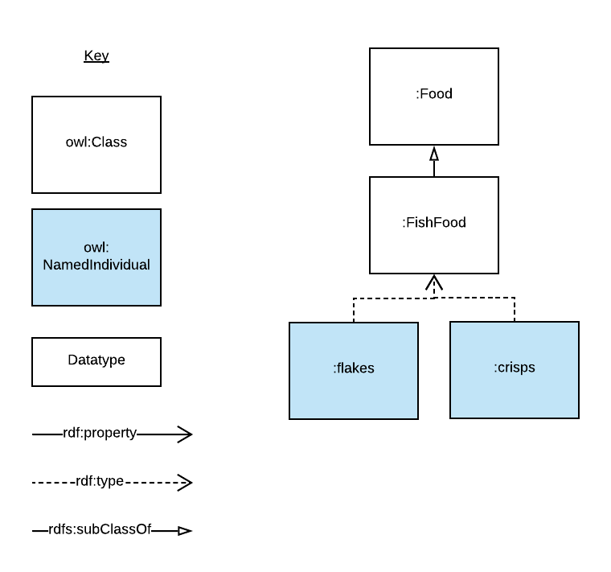

= Examples Ontology
:encoding: utf-8
:lang: en
:table-stripes: even
:toc:
:toc-placement!:
:toclevels: 3
:sectnumlevels: 4
:sectanchors:
:figure-id: 0
:table-id: 0
:req-id: 0
:rec-id: 0
:per-id: 0
:xrefstyle: short
:chapter-refsig: Clause
:idprefix:
:idseparator:

<<<
_ASCIIDOC documentation created by http://github.com/rdflib/pyLODE[pyLODE] 2.9.2_

<<<
IRI::
  * `https://example.com`
Publisher(s)::
  * None
Creators(s)::
  * link:http://orcid.org/0000-0002-8742-7730[Nicholas J. Car]
    [link:http://orcid.org/0000-0002-8742-7730[0000-0002-8742-7730]]
Contributor(s)::
  * Santa Clause
Created::
  * 2021-05-05
Modified::
  2019-10-21
Version Information::
  0.9
Version URI::
  link:https://example.com/0.9[https://example.com/0.9]
License & Rights::
  * link:https://creativecommons.org/licenses/by/4.0/[https://creativecommons.org/licenses/by/4.0/]
  * &copy; SURROUND Australia Pty Ltd

Ontology RDF::
  RDF link:examples.ttl[turtle]
Description::
  This ontology contains several simple classes and properties about animals that are defined only to show off pyLODE's ability to represent different forms of example rendering.

toc::[]
<<<

:sectnums!:

== Classes
<li>link:#Creature[Creature]</li>
<li>link:#Fish[Fish]</li>
<li>link:#Fishfood[Fish food]</li>
<li>link:#Food[Food]</li>
[#Creature]
=== Creature

[cols="1,4a",options=header]
|===
|Property
|Value

|IRI
|`https://example.com#Creature`
|Description
|A Creature is a living animal
|Scope Notes
|class with link example
|Example(s)
|
https://example.com/individuals/creature-x 

&nbsp;
|Restrictions
|* link:#bornorhatcheddate[born or hatched date] ^dp^ **exactly** 1

|Sub-classes
|* link:#Fish[Fish] ^c^

|In domain of
|* link:#bornorhatcheddate[born or hatched date] ^dp^

|===
[#Fish]
=== Fish

[cols="1,4a",options=header]
|===
|Property
|Value

|IRI
|`https://example.com#Fish`
|Description
|Fish are aquatic, craniate, gill-bearing animals that lack limbs with digits. They form a sister group to the tunicates, together forming the olfactores. Included in this definition are the living hagfish, lampreys, and cartilaginous and bony fish as well as various extinct related groups. Around 99% of living fish species are ray-finned fish, belonging to the class Actinopterygii, with over 95% belonging to the teleost subgrouping.
|Scope Notes
|class with example in inline JSON-LD
|Example(s)
|
....
{
  "@id": "https://example.com#flipper",
  "@type": "https://example.com#Fish",
  "http://www.w3.org/2004/02/skos/core#definition": "Flipper is the fish that lives in Nick's fish tank",
  "http://www.w3.org/2004/02/skos/core#prefLabel": "Flipper the Fish",
  "https://example.com#hasScaleColour": {
    "@id": "http://example-voc.com/concept/Orange"
  },
  "https://example.com#livesInFreshWater": true,
  "https://example.com#livesInSaltWater": false
}
....

&nbsp;
|Super-classes
|* link:#Creature[Creature] ^c^

|Restrictions
|* link:#livesinsaltwater[lives in salt water] ^dp^ **exactly** 1
* link:#eats[eats] ^op^ **min** 1
* link:#livesinfreshwater[lives in fresh water] ^dp^ **exactly** 1
* link:#livesinestuarinewater[lives in estuarine water] ^dp^ **exactly** 1

|In domain of
|* link:#livesinfreshwater[lives in fresh water] ^dp^
* link:#livesinsaltwater[lives in salt water] ^dp^
* link:#livesinestuarinewater[lives in estuarine water] ^dp^

|===
[#Fishfood]
=== Fish food

[cols="1,4a",options=header]
|===
|Property
|Value

|IRI
|`https://example.com#FishFood`
|Description
|Fish food is food primarily eaten by fish. It may also be eaten by other Creatures too
|Scope Notes
|class with a local image example
|Example(s)
|

&nbsp;
|Super-classes
|* link:#Food[Food] ^c^

|===
[#Food]
=== Food

[cols="1,4a",options=header]
|===
|Property
|Value

|IRI
|`https://example.com#Food`
|Description
|Food is consumed by Creatures to give them energy
|Scope Notes
|class with an external URI example
|Example(s)
|
http://fake.com/thing/food-x 

&nbsp;
|Sub-classes
|* link:#Fishfood[Fish food] ^c^

|In range of
|* link:#eats[eats] ^op^

|===
== Properties
=== Object Properties
link:#eats[eats]
link:#hasscalecolour[has scale colour]
[#eats]
==== eats

[cols="1,4a",options=header]
|===
|Property
|Value

|IRI
|`https://example.com#eats`
|Description
|A creature eats a kind of food
|Scope Notes
|property with two Resource Descriptor example in same file, conforms to this ontology and something else (http://other.com)
|Example(s)
|
....
<?xml version="1.0" encoding="UTF-8"?>
<rdf:RDF
   xmlns="https://example.com"
   xmlns:rdf="http://www.w3.org/1999/02/22-rdf-syntax-ns#"
>
  <rdf:Description rdf:about="file:///Users/nick/Work/rdflib/pyLODE/pylode/examples/examples-ont/y2">
    <rdf:type rdf:resource="https://example.comFood"/>
  </rdf:Description>
  <rdf:Description rdf:about="file:///Users/nick/Work/rdflib/pyLODE/pylode/examples/examples-ont/x2">
    <rdf:type rdf:resource="https://example.comCreature"/>
    <eats rdf:resource="file:///Users/nick/Work/rdflib/pyLODE/pylode/examples/examples-ont/y2"/>
  </rdf:Description>
</rdf:RDF>
....

Conforms to: link:https://other.com[https://other.com]

....
<x> a :Creature ;
    :eats <y> ;
.
<y> a :Food .
....

Conforms to: link:https://example.com[https://example.com]

    |Range(s) 
    |* link:https://example.com#Food[Food] ^c^

|===
[#hasscalecolour]
==== has scale colour

[cols="1,4a",options=header]
|===
|Property
|Value

|IRI
|`https://example.com#hasScaleColour`
|Description
|A colour of the fish's scales. Can have multiple colours.
|Scope Notes
|property with example in inline HTML
|Example(s)
|
+++<strong><em>scale colour</em></strong>:<ul><li>blue</li><li>orange</li><li>white</li></ul>+++
&nbsp;

    |Range(s) 
    |* link:http://www.w3.org/2004/02/skos/core#Concept[skos:Concept] ^c^

|===

=== Datatype Properties
link:#bornorhatcheddate[born or hatched date]
link:#livesinestuarinewater[lives in estuarine water]
link:#livesinfreshwater[lives in fresh water]
link:#livesinsaltwater[lives in salt water]
[#bornorhatcheddate]
==== born or hatched date

[cols="1,4a",options=header]
|===
|Property
|Value

|IRI
|`https://example.com#bornOrHatchedDate`
|Description
|The Gregorian calendar date on which this Creature was born or hatched
|Scope Notes
|property with example in inline XML
|Example(s)
|
....
<?xml version="1.0" encoding="UTF-8"?>
<rdf:RDF
   xmlns="https://example.com#"
   xmlns:rdf="http://www.w3.org/1999/02/22-rdf-syntax-ns#"
>
  <rdf:Description rdf:about="https://example.com#flipper">
    <rdf:type rdf:resource="https://example.com#Fish"/>
    <bornOrHatchedDate rdf:datatype="http://www.w3.org/2001/XMLSchema#date">2020-05-11</bornOrHatchedDate>
  </rdf:Description>
</rdf:RDF>

....

    |Domain(s)
    |* link:#Creature[Creature] ^c^
    |Range(s) 
    |* link:http://www.w3.org/2001/XMLSchema#date[xsd:date] ^c^

|===
[#livesinestuarinewater]
==== lives in estuarine water

[cols="1,4a",options=header]
|===
|Property
|Value

|IRI
|`https://example.com#livesInEstuarineWater`
|Description
|True if the fish lives in estuarine water. It may also live in other water
|Scope Notes
|property with example using Resource Descriptor for inline Markdown
|Example(s)
|
+++
<strong>lives in estuarine water</strong>: <em>true</em>
+++
&nbsp;

    |Domain(s)
    |* link:#Fish[Fish] ^c^
    |Range(s) 
    |* link:http://www.w3.org/2001/XMLSchema#boolean[xsd:boolean] ^c^

|===
[#livesinfreshwater]
==== lives in fresh water

[cols="1,4a",options=header]
|===
|Property
|Value

|IRI
|`https://example.com#livesInFreshWater`
|Description
|True if the fish lives in fresh water. It may also live in other water
|Scope Notes
|property with example in inline RDF
|Example(s)
|
....
<x> a eg:Fish ;
    skos:prefLabel "Fish X"@en ;
    eg:livesInFreshWater true ;
    ...
.
....

    |Domain(s)
    |* link:#Fish[Fish] ^c^
    |Range(s) 
    |* link:http://www.w3.org/2001/XMLSchema#boolean[xsd:boolean] ^c^

|===
[#livesinsaltwater]
==== lives in salt water

[cols="1,4a",options=header]
|===
|Property
|Value

|IRI
|`https://example.com#livesInSaltWater`
|Description
|True if the fish lives in salt water. It may also live in other water
|Scope Notes
|property with an remote-hosted image example
|Example(s)
|
image::https://raw.githubusercontent.com/RDFLib/pyLODE/master/pylode/examples/examples-ont/toothy.png[]

    |Domain(s)
    |* link:#Fish[Fish] ^c^
    |Range(s) 
    |* link:http://www.w3.org/2001/XMLSchema#boolean[xsd:boolean] ^c^

|===

## Named Individuals
== Namespaces
default (eggs)::
    `https://example.com#`
dcterms::
  `http://purl.org/dc/terms/`
orcid::
  `http://orcid.org/`
owl::
  `http://www.w3.org/2002/07/owl#`
prof::
  `http://www.w3.org/ns/dx/prof/`
prov::
  `http://www.w3.org/ns/prov#`
rdf::
  `http://www.w3.org/1999/02/22-rdf-syntax-ns#`
rdfs::
  `http://www.w3.org/2000/01/rdf-schema#`
sdo::
  `https://schema.org/`
skos::
  `http://www.w3.org/2004/02/skos/core#`
vann::
  `http://purl.org/vocab/vann/`
xsd::
  `http://www.w3.org/2001/XMLSchema#`

== Legend
* Classes: **c**
* Object Properties: **op**
* Functional Properties: **fp**
* Data Properties: **dp**
* Annotation Properties: **dp**
* Properties: **p**
* Named Individuals: **ni**