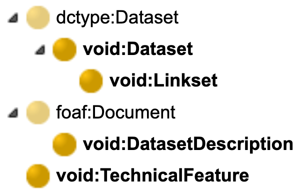

# Vocabulary of Interlinked Datasets (VoID)
metadata by [pyLODE](http://github.com/rdflib/pyLODE)
## Metadata
* **IRI**
  * `http://vocab.deri.ie/void`
* **Publisher(s)**
  * <a href="http://vocab.deri.ie/void#Digital%20Enterprise%20Research%20Institute%2C%20NUI%20Galway">Digital Enterprise Research Institute, NUI Galway</a>
* **Creators(s)**
  * <a href="mailto:Keith.Alexander@talis.com">Keith Alexander</a> of <a href="http://www.talis.com/">Talis</a>
  * <a href="mailto:richard.cyganiak@deri.org">Richard Cyganiak</a> of <a href="http://www.deri.ie/">Digital Enterprise Research Institute, NUI Galway</a>
  * <a href="mailto:jun.zhao@zoo.ox.ac.uk">Jun Zhao</a> of <a href="http://www.zoo.ox.ac.uk/">Department of Zoology, University of Oxford</a>
  * <a href="mailto:michael.hausenblas@deri.org">Michael Hausenblas</a> of <a href="http://linkeddata.deri.ie/">LiDRC</a>
* **Created**
  * 2010-01-26
* **Modified**
  * 2011-03-06
* **Ontology Source**
  * <a href="void.ttl">RDF (turtle)</a>
### Description

The Vocabulary of Interlinked Datasets (VoID) is an RDF Schema vocabulary for expressing metadata about RDF datasets. It is intended as a bridge between the publishers and users of RDF data, with applications ranging from data discovery to cataloging and archiving of datasets. This document provides a formal definition of the new RDF classes and properties introduced for VoID. It is a companion to the main specification document for VoID, <em><a href="http://www.w3.org/TR/void/">Describing Linked Datasets with the VoID Vocabulary</a></em>.

## Table of Contents
* [Classes](#classes)
* [Object Properties](#objectproperties)
* [Functional Properties](#functionalproperties)
* [Datatype Properties](#datatypeproperties)
* [Namespaces](#namespaces)  

## Overview
 
**Figure 1:** VOID classes in a hierarchy  
 
**Figure 2:** VOID properties in a hierarchy 
 
## Classes
[dataset](#dataset),
[dataset description](#datasetdescription),
[linkset](#linkset),
[technical feature](#technicalfeature),
### dataset c
Property | Value
--- | ---
IRI | `http://rdfs.org/ns/void#Dataset`
Description | A set of RDF triples that are published, maintained or aggregated by a single provider.
In domain of |<a href="#opensearchdescription">void:openSearchDescription</a>op <a href="http://rdfs.org/ns/void#uriRegexPattern">void:uriRegexPattern</a> <a href="#distinctobjects">void:distinctObjects</a>dp <a href="#classes">void:classes</a>dp <a href="#numberoftriples">void:triples</a>dp <a href="#hasanURIlook-upendpointat">void:uriLookupEndpoint</a>op <a href="#distinctsubjects">void:distinctSubjects</a>dp <a href="#feature">void:feature</a>op <a href="#numberofproperties">void:properties</a>dp <a href="#DataDump">void:dataDump</a>op <a href="#vocabulary">void:vocabulary</a>op <a href="#class">void:class</a>fp <a href="#hassubset">void:subset</a>op <a href="#property">void:property</a>fp <a href="#classpartition">void:classPartition</a>op <a href="#numberofdocuments">void:documents</a>dp <a href="#rootresource">void:rootResource</a>op <a href="#numberofentities">void:entities</a>dp <a href="#hasaSPARQLendpointat">void:sparqlEndpoint</a>op <a href="#propertypartition">void:propertyPartition</a>op <a href="#URIspace">void:uriSpace</a>dp <a href="#exampleresourceofdataset">void:exampleResource</a>op 
In range of |<a href="#indataset">void:inDataset</a>op <a href="#Target">void:target</a>op <a href="#SubjectsTarget">void:subjectsTarget</a>fp <a href="#ObjectsTarget">void:objectsTarget</a>fp <a href="#hassubset">void:subset</a>op <a href="#classpartition">void:classPartition</a>op <a href="#propertypartition">void:propertyPartition</a>op 
### dataset description c
Property | Value
--- | ---
IRI | `http://rdfs.org/ns/void#DatasetDescription`
Description | A web resource whose foaf:primaryTopic or foaf:topics include void:Datasets.
Super-classes |<a href="http://xmlns.com/foaf/0.1/Document">foaf:Document</a>c 
Restrictions |
Sub-classes |
### linkset c
Property | Value
--- | ---
IRI | `http://rdfs.org/ns/void#Linkset`
Description | A collection of RDF links between two void:Datasets.
Super-classes |<a href="#dataset">void:Dataset</a>c 
Restrictions |
Sub-classes |
In domain of |<a href="#ObjectsTarget">void:objectsTarget</a>fp <a href="#SubjectsTarget">void:subjectsTarget</a>fp <a href="#alinkpredicate">void:linkPredicate</a>op <a href="#Target">void:target</a>op 
### technical feature c
Property | Value
--- | ---
IRI | `http://rdfs.org/ns/void#TechnicalFeature`
Description | A technical feature of a void:Dataset, such as a supported RDF serialization format.
In range of |<a href="#feature">void:feature</a>op 

## Object Properties
[class partition](classpartition),
[Data Dump](DataDump),
[example resource of dataset](exampleresourceofdataset),
[feature](feature),
[in dataset](indataset),
[a link predicate](alinkpredicate),
[open search description](opensearchdescription),
[property partition](propertypartition),
[root resource](rootresource),
[has a SPARQL endpoint at](hasaSPARQLendpointat),
[has subset](hassubset),
[Target](Target),
[has an URI look-up endpoint at](hasanURIlook-upendpointat),
[vocabulary](vocabulary),

### class partition op
Property | Value
--- | ---
IRI | `http://rdfs.org/ns/void#classPartition`
Description | A subset of a void:Dataset that contains only the entities of a certain rdfs:Class.
Super-properties |<a href="#hassubset">void:subset</a>op 
Domain(s) |<a href="#dataset">void:Dataset</a>c 
Range(s) |<a href="#dataset">void:Dataset</a>c 

### Data Dump op
Property | Value
--- | ---
IRI | `http://rdfs.org/ns/void#dataDump`
Description | An RDF dump, partial or complete, of a void:Dataset.
Domain(s) |<a href="#dataset">void:Dataset</a>c 
Range(s) |<a href="http://www.w3.org/2000/01/rdf-schema#Resource">rdfs:Resource</a>c 

### example resource of dataset op
Property | Value
--- | ---
IRI | `http://rdfs.org/ns/void#exampleResource`
Domain(s) |<a href="#dataset">void:Dataset</a>c 
Range(s) |<a href="http://www.w3.org/2000/01/rdf-schema#Resource">rdfs:Resource</a>c 

### feature op
Property | Value
--- | ---
IRI | `http://rdfs.org/ns/void#feature`
Domain(s) |<a href="#dataset">void:Dataset</a>c 
Range(s) |<a href="#technicalfeature">void:TechnicalFeature</a>c 

### in dataset op
Property | Value
--- | ---
IRI | `http://rdfs.org/ns/void#inDataset`
Description | Points to the void:Dataset that a document is a part of.
Domain(s) |<a href="http://xmlns.com/foaf/0.1/Document">foaf:Document</a>c 
Range(s) |<a href="#dataset">void:Dataset</a>c 

### a link predicate op
Property | Value
--- | ---
IRI | `http://rdfs.org/ns/void#linkPredicate`
Domain(s) |<a href="#linkset">void:Linkset</a>c 
Range(s) |<a href="http://www.w3.org/1999/02/22-rdf-syntax-ns#Property">rdf:Property</a>c 

### open search description op
Property | Value
--- | ---
IRI | `http://rdfs.org/ns/void#openSearchDescription`
Description | An OpenSearch description document for a free-text search service over a void:Dataset.
Domain(s) |<a href="#dataset">void:Dataset</a>c 
Range(s) |<a href="http://xmlns.com/foaf/0.1/Document">foaf:Document</a>c 

### property partition op
Property | Value
--- | ---
IRI | `http://rdfs.org/ns/void#propertyPartition`
Description | A subset of a void:Dataset that contains only the triples of a certain rdf:Property.
Super-properties |<a href="#hassubset">void:subset</a>op 
Domain(s) |<a href="#dataset">void:Dataset</a>c 
Range(s) |<a href="#dataset">void:Dataset</a>c 

### root resource op
Property | Value
--- | ---
IRI | `http://rdfs.org/ns/void#rootResource`
Description | A top concept or entry point for a void:Dataset that is structured in a tree-like fashion. All resources in a dataset can be reached by following links from its root resources in a small number of steps.
Domain(s) |<a href="#dataset">void:Dataset</a>c 

### has a SPARQL endpoint at op
Property | Value
--- | ---
IRI | `http://rdfs.org/ns/void#sparqlEndpoint`
Domain(s) |<a href="#dataset">void:Dataset</a>c 

### has subset op
Property | Value
--- | ---
IRI | `http://rdfs.org/ns/void#subset`
Domain(s) |<a href="#dataset">void:Dataset</a>c 
Range(s) |<a href="#dataset">void:Dataset</a>c 

### Target op
Property | Value
--- | ---
IRI | `http://rdfs.org/ns/void#target`
Description | One of the two datasets linked by the Linkset.
Domain(s) |<a href="#linkset">void:Linkset</a>c 
Range(s) |<a href="#dataset">void:Dataset</a>c 

### has an URI look-up endpoint at op
Property | Value
--- | ---
IRI | `http://rdfs.org/ns/void#uriLookupEndpoint`
Description | Defines a simple URI look-up protocol for accessing a dataset.
Domain(s) |<a href="#dataset">void:Dataset</a>c 

### vocabulary op
Property | Value
--- | ---
IRI | `http://rdfs.org/ns/void#vocabulary`
Description | A vocabulary that is used in the dataset.
Domain(s) |<a href="#dataset">void:Dataset</a>c 

## Functional Properties
[class](class),
[Objects Target](ObjectsTarget),
[property](property),
[Subjects Target](SubjectsTarget),

### class fp
Property | Value
--- | ---
IRI | `http://rdfs.org/ns/void#class`
Description | The rdfs:Class that is the rdf:type of all entities in a class-based partition.
Domain(s) |<a href="#dataset">void:Dataset</a>c 
Range(s) |<a href="http://www.w3.org/2000/01/rdf-schema#Class">rdfs:Class</a>c 

### Objects Target fp
Property | Value
--- | ---
IRI | `http://rdfs.org/ns/void#objectsTarget`
Description | The dataset describing the objects of the triples contained in the Linkset.
Super-properties |<a href="#Target">void:target</a>op 
Domain(s) |<a href="#linkset">void:Linkset</a>c 
Range(s) |<a href="#dataset">void:Dataset</a>c 

### property fp
Property | Value
--- | ---
IRI | `http://rdfs.org/ns/void#property`
Description | The rdf:Property that is the predicate of all triples in a property-based partition.
Domain(s) |<a href="#dataset">void:Dataset</a>c 
Range(s) |<a href="http://www.w3.org/1999/02/22-rdf-syntax-ns#Property">rdf:Property</a>c 

### Subjects Target fp
Property | Value
--- | ---
IRI | `http://rdfs.org/ns/void#subjectsTarget`
Description | The dataset describing the subjects of triples contained in the Linkset.
Super-properties |<a href="#Target">void:target</a>op 
Domain(s) |<a href="#linkset">void:Linkset</a>c 
Range(s) |<a href="#dataset">void:Dataset</a>c 

## Datatype Properties
[classes](classes),
[distinct objects](distinctobjects),
[distinct subjects](distinctsubjects),
[number of documents](numberofdocuments),
[number of entities](numberofentities),
[number of properties](numberofproperties),
[number of triples](numberoftriples),
[URI space](URIspace),

### classes dp
Property | Value
--- | ---
IRI | `http://rdfs.org/ns/void#classes`
Description | The total number of distinct classes in a void:Dataset. In other words, the number of distinct resources occuring as objects of rdf:type triples in the dataset.
Domain(s) |<a href="#dataset">void:Dataset</a>c 
Range(s) |<a href="http://www.w3.org/2001/XMLSchema#integer">xsd:integer</a>c 

### distinct objects dp
Property | Value
--- | ---
IRI | `http://rdfs.org/ns/void#distinctObjects`
Description | The total number of distinct objects in a void:Dataset. In other words, the number of distinct resources that occur in the object position of triples in the dataset. Literals are included in this count.
Domain(s) |<a href="#dataset">void:Dataset</a>c 
Range(s) |<a href="http://www.w3.org/2001/XMLSchema#integer">xsd:integer</a>c 

### distinct subjects dp
Property | Value
--- | ---
IRI | `http://rdfs.org/ns/void#distinctSubjects`
Description | The total number of distinct subjects in a void:Dataset. In other words, the number of distinct resources that occur in the subject position of triples in the dataset.
Domain(s) |<a href="#dataset">void:Dataset</a>c 
Range(s) |<a href="http://www.w3.org/2001/XMLSchema#integer">xsd:integer</a>c 

### number of documents dp
Property | Value
--- | ---
IRI | `http://rdfs.org/ns/void#documents`
Description | The total number of documents, for datasets that are published as a set of individual documents, such as RDF/XML documents or RDFa-annotated web pages. Non-RDF documents, such as web pages in HTML or images, are usually not included in this count. This property is intended for datasets where the total number of triples or entities is hard to determine. void:triples or void:entities should be preferred where practical.
Domain(s) |<a href="#dataset">void:Dataset</a>c 
Range(s) |<a href="http://www.w3.org/2001/XMLSchema#integer">xsd:integer</a>c 

### number of entities dp
Property | Value
--- | ---
IRI | `http://rdfs.org/ns/void#entities`
Description | The total number of entities that are described in a void:Dataset.
Domain(s) |<a href="#dataset">void:Dataset</a>c 
Range(s) |<a href="http://www.w3.org/2001/XMLSchema#integer">xsd:integer</a>c 

### number of properties dp
Property | Value
--- | ---
IRI | `http://rdfs.org/ns/void#properties`
Description | The total number of distinct properties in a void:Dataset. In other words, the number of distinct resources that occur in the predicate position of triples in the dataset.
Domain(s) |<a href="#dataset">void:Dataset</a>c 
Range(s) |<a href="http://www.w3.org/2001/XMLSchema#integer">xsd:integer</a>c 

### number of triples dp
Property | Value
--- | ---
IRI | `http://rdfs.org/ns/void#triples`
Description | The total number of triples contained in a void:Dataset.
Domain(s) |<a href="#dataset">void:Dataset</a>c 
Range(s) |<a href="http://www.w3.org/2001/XMLSchema#integer">xsd:integer</a>c 

### URI space dp
Property | Value
--- | ---
IRI | `http://rdfs.org/ns/void#uriSpace`
Description | A URI that is a common string prefix of all the entity URIs in a void:Dataset.
Domain(s) |<a href="#dataset">void:Dataset</a>c 
Range(s) |<a href="http://www.w3.org/2000/01/rdf-schema#Literal">rdfs:Literal</a>c 

## Namespaces
* **default (:)**
  * `http://rdfs.org/ns/void#`
* **adms**
  * `http://www.w3.org/ns/adms#`
* **dc**
  * `http://purl.org/dc/elements/1.1/`
* **dct**
  * `http://purl.org/dc/terms/`
* **foaf**
  * `http://xmlns.com/foaf/0.1/`
* **owl**
  * `http://www.w3.org/2002/07/owl#`
* **rdf**
  * `http://www.w3.org/1999/02/22-rdf-syntax-ns#`
* **rdfs**
  * `http://www.w3.org/2000/01/rdf-schema#`
* **sdo**
  * `https://schema.org/`
* **vann**
  * `http://purl.org/vocab/vann/`
* **void**
  * `http://rdfs.org/ns/void#`
* **xml**
  * `http://www.w3.org/XML/1998/namespace`
* **xsd**
  * `http://www.w3.org/2001/XMLSchema#`

## Legend
* Classes: c
* Object Properties :op
* Functional Properties: fp
* Data Properties: dp
* Annotation Properties: dp
* Properties: p
* Named Individuals: ni